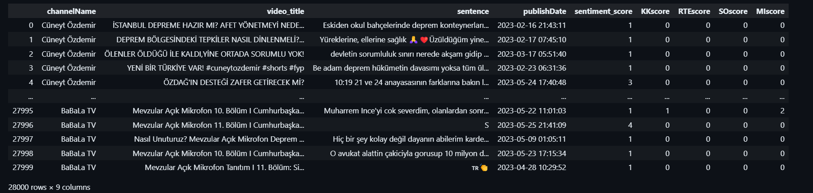

# Election Sentiment and Popularity Analysis In Türkiye

## Purpose of the Research <a name="goal">
Our hypothesis for the project was that as the 2023 elections approached in Turkey, the average sentiment scores would decrease, indicating a rise in negative emotions such as hatred, resentment, and sadness. We expected the frequency of candidate mentions in comments to increase over time due to escalating tension and growing interest toward the end of the election.

We aimed to observe whether emotions toward candidates followed similar patterns. Specifically, we tested the idea that some candidates are more popular among the population than others. Additionally, we wanted to track changes in emotions toward candidates over time.

Furthermore, we sought to determine if there were any fluctuations in the popularity of candidates over time.

## Table of Contents
+ ### [1 - Generating Dataset](#data_collection)
+ ### [2 - Text Processing](#text_processing)
+ ### [3 - Generating Analysis-Ready Dataset](#analysis_ready_dataset)
+ ### [4 - Associating Comments with the Candidates Using Machine Learning Classification](#classification_ML)
+ ### [5 - Results and Findings](#findings)
+ ### [6 - Conclusion](#conclusion)
+ ### [Contributors](#contributors)


| Folder | Content of the Folder |
| :--- | :---------- |
| `scripts` | The files in this folder represent the initial steps of the project, focusing on gathering and cleaning the data. |
| `data_sources`   | This folder comprises sets of data, starting from the initial raw version of the collected data to the finalized analysis-ready version. |
| `analysis` | This folder contains our analysis conducted on the data we've collected and cleaned, spanning a wide range of data representations. In addition to that, it also includes our ML model that classifies unlabeled data.

## Chapter 1 - Generating the dataset <a name="data_collection">
To collect the data necessary for our analysis, we utilized the YouTube API. As the initial step of our project, we identified a subset of YouTube channels to be analyzed. The selection criteria for these channels were based on ensuring coverage of the ideological spectrum of the population. Therefore, we followed two main criteria:
 - Content creators whose content predominantly revolves around political issues.
 - Inclusion of channels representing both government-aligned and opposition-aligned viewpoints in the subset.

After finalizing the list of channels for inspection, we proceeded to collect the titles of videos published between February 2023 and June 2023, along with their respective publish dates. Using these titles, we extracted 100 random comments from each video to build our dataset.

At the conclusion of the data collection phase of our project, we created an Excel file for each channel in our list. Each file contained the following columns: channelName, video_title, sentence, and publishDate.

## Chapter 2 - Text Processing <a name="text_processing">

As the initial step of this phase, we utilized the ``GoogleTranslator`` library to translate the comments into English. The rationale behind this translation was to facilitate the implementation of sentiment analysis and lemmatization techniques, which are more effective in English.

Once the translation was completed, we converted emojis into text representations, such as `❤️ -> "red heart"` to enhance the quality of sentiment analysis. Following this, lemmatization techniques were applied to further improve the accuracy of sentiment analysis.

Additionally, we aimed to associate the candidates with the comments that mention them. To achieve this, we manually curated a list for each candidate in the election, capturing the relationship between the comments and the candidate.

Once the comments were matched with the relevant candidates, we conducted sentiment analysis for each comment, generating a numerical score between 1 (indicating a negative comment) and 5 (indicating a positive comment). Subsequently, we appended a column to our dataset to indicate the sentiment score of each corresponding comment.

```
from transformers import pipeline

sentiment_classifier = pipeline("sentiment-analysis", model="nlptown/bert-base-multilingual-uncased-sentiment")
```

## Chapter 3 - Generating Analysis-Ready Dataset <a name="analysis_ready_dataset">
Due to the size constraints of the large datasets in the ``raw_dataset`` folder, we faced challenges in implementing timely sentiment analysis and data analysis. Consequently, we opted to downscale the datasets into smaller, more manageable and homogeneous sets. We randomly selected 2000 comments per channel to generate reduced datasets, which were then stored in the ``reduced_dataset_2K`` folder.

Following the reduction of datasets into more scalable formats, we proceeded to conduct sentiment analysis on each dataset. The results of this analysis were merged into a single set, represented as a .csv file and contains 28000 comments, which was stored in the ``analysis_ready_dataset`` folder.



## Chapter 4- Associating Comments with the Candidates Using Machine Learning Classification <a name="classification_ML">
Before proceeding with the analysis, we needed to associate comments with the candidates that couldn't be matched previously using our predefined list. To accomplish this, we employed machine learning classification techniques, utilizing the ``sklearn`` library. We trained the model using already labeled comments and applied the trained models to unlabeled data.

To evaluate the performance of our classification model, we employed metrics such as the confusion matrix and F1 score. The F1 score of our model is as follows:

```
Accuracy:  0.8542246982358404  | F1 score:  0.8519897897718007
```


## Chapter 5 - Results and Findings <a name="findings">
First, we wanted to check how many comments were associated with each candidate and the average sentiment scores of those comments. We couldn't find any meaningful difference between the average sentiment scores of the candidates, as can be observed from the following graph.


In the graph below, we aimed to observe the change in the frequency of mentions over time on a daily basis. As expected, the frequency of comments increased over time for every candidate due to the growing interest in the upcoming elections, except for Muharrem İnce. The exception with Muharrem İnce is attributed to his decision to no longer participate in the elections, which explains the significant decrease in mentions near the election period.


The change in sentiments/emotions for the candidates can be observed from the graphs below. One notable observation is the increase in negative comments towards Muharrem İnce (decrease in sentiment scores) following his decision to no longer participate in the elections. 

Additionally, it's worth mentioning that Kemal Kılıçdaroğlu's sentiment scores increased more than the other candidates over the election period. However, it's important to note that his score started lower than others, which is also a significant factor. Apart from these observations, many other insights can be inferred from the graphs beyond the ones we highlighted.


The table below consists of hotspot words mentioned in the comments and the candidates associated with them. For example, ``HDP``, a political party that sparks heated debates in Turkey, is mostly associated with Kemal Kılıçdaroğlu with 161 comments, followed by Erdoğan with 138 comments.

``Din`` (Religion) is prominently associated with Erdoğan rather than the other candidates, with 2187 comments. This is understandable, as Recep Tayyip Erdoğan is perceived as a more conservative figure than the others.


| Keyword | R.T.Erdoğan | K.Kılıçdaroğlu | M.İnce | S.Oğan |
| :------ | :------ | :- | :- | :- |
| HDP     | 138 | 161 | 0 | 0 |
| Din (_Religion_) | 2187 | 161 | 1 | 0 |

For a more detailed analysis that is not presented here, you can refer to the ``Data_Analysis.ipynb`` file or the ``CS210_Presentation.pdf`` file.

## Chapter 6 - Conclusion <a name="conclusion">

As expected, the frequency of comments mentioning politics increased over time leading up to the upcoming elections. However, we observed some notable changes or fluctuations in the sentiment scores of the candidates over time as the elections approached. Despite this, the average popularity of the candidates did not differ significantly enough to make a conclusive point.


### Contributors: <a name="contributors">
| Work | Contributors |
| :--- | :----------: |
| Data Collection | Hasan Fırat Yılmaz & Anıl Şen        |
| Data Cleaning   | Hasan Fırat Yılmaz & Anıl Şen        |
| Sentiment Analysis | Hasan Fırat Yılmaz & Anıl Şen     |
| Data Analysis | Mustafa & Mert &  Orhun & Anıl & Hasan |
| Presentation | Mustafa & Mert &  Orhun & Anıl & Hasan  |
